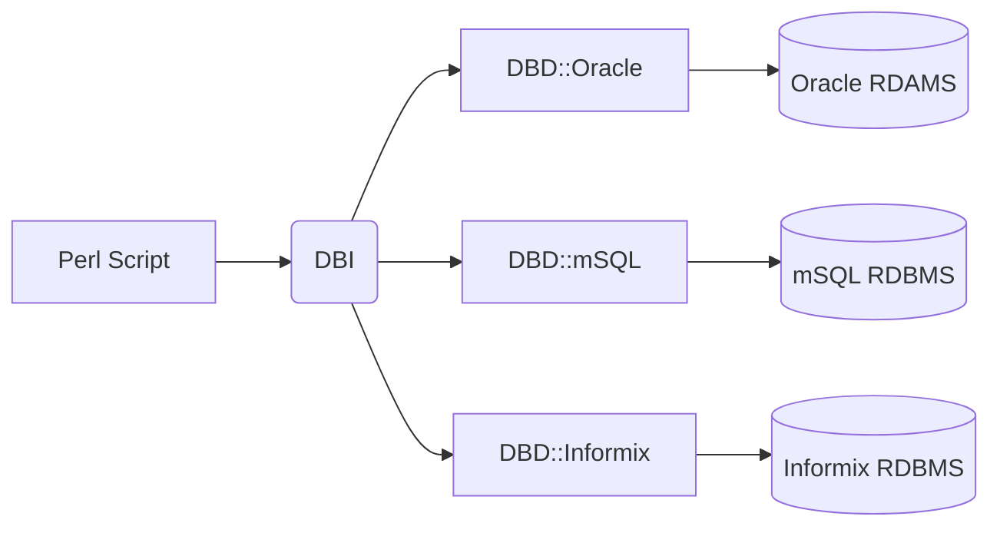

# Perl 数据库连接

本章节我们将为大家介绍 Perl 数据库的连接。

Perl 5 中我们可以使用 DBI 模块来连接数据库。

DBI 英文全称：Database Independent Interface，中文称为数据库独立接口。

DBI 作为 Perl 语言中和数据库进行通讯的标准接口，它定义了一系列的方法，变量和常量，提供一个和具体数据库平台无关的数据库持久层。

------

## DBI 结构

DBI 和具体数据库平台无关，我们可以将其应用在Oracle, MySQL 或 Informix, 等数据库中。



### 变量名约定

以下设置了比较常用的变量名命名方法：

```
$dsn    驱动程序对象的句柄
$dbh    一个数据库对象的句柄
$sth    一个语句或者一个查询对象的句柄
$h      通用的句柄 ($dbh, $sth, 或 $drh)，依赖于上下文
$rc     操作代码返回的布什值（true 或 false）
$rv     操作代码返回的整数值
@ary    查询返回的一行值的数组（列表）
$rows   操作代码返回的行数值
$fh     文件句柄
undef   NULL 值表示未定义
\%attr  引用属性的哈希值并传到方法上
```

------

## 数据库连接

接下来我们以 MySQL 数据库为例演示 Perl 是如何对数据库进行操作的。

这里我们在 MySQL 数据库创建 RUNOOB 数据库，数据表为 Websites，表结构及数据如下图所示：

```mysql
/*
 Navicat MySQL Data Transfer

 Source Server         : 127.0.0.1
 Source Server Version : 50621
 Source Host           : localhost
 Source Database       : RUNOOB

 Target Server Version : 50621
 File Encoding         : utf-8

 Date: 06/17/2016 13:41:50 PM
*/

SET NAMES utf8;
SET FOREIGN_KEY_CHECKS = 0;

-- ----------------------------
--  Table structure for `websites`
-- ----------------------------
DROP TABLE IF EXISTS `websites`;
CREATE TABLE `websites` (
  `id` int(11) NOT NULL AUTO_INCREMENT,
  `name` char(20) NOT NULL DEFAULT '' COMMENT '站点名称',
  `url` varchar(255) NOT NULL DEFAULT '',
  `alexa` int(11) NOT NULL DEFAULT '0' COMMENT 'Alexa 排名',
  `country` char(10) NOT NULL DEFAULT '' COMMENT '国家',
  PRIMARY KEY (`id`)
) ENGINE=InnoDB AUTO_INCREMENT=8 DEFAULT CHARSET=utf8;

-- ----------------------------
--  Records of `websites`
-- ----------------------------
BEGIN;
INSERT INTO `websites` VALUES ('1', 'Google', 'https://www.google.cm/', '1', 'USA'), ('2', '淘宝', 'https://www.taobao.com/', '13', 'CN'), ('3', '菜鸟教程', 'http://www.runoob.com/', '5000', 'USA'), ('4', '微博', 'http://weibo.com/', '20', 'CN'), ('5', 'Facebook', 'https://www.facebook.com/', '3', 'USA'), ('7', 'stackoverflow', 'http://stackoverflow.com/', '0', 'IND');
COMMIT;

SET FOREIGN_KEY_CHECKS = 1;

```

接下来我们使用以下代码来连接数据库：

```perl
#!/usr/bin/perl -w
 
use strict;
use DBI;
 
my $host = "localhost";         # 主机地址
my $driver = "mysql";           # 接口类型 默认为 localhost
my $database = "RUNOOB";        # 数据库
# 驱动程序对象的句柄
my $dsn = "DBI:$driver:database=$database:$host";  
my $userid = "root";            # 数据库用户名
my $password = "123456";        # 数据库密码
 
# 连接数据库
my $dbh = DBI->connect($dsn, $userid, $password ) or die $DBI::errstr;
my $sth = $dbh->prepare("SELECT * FROM Websites");   # 预处理 SQL  语句
$sth->execute();    # 执行 SQL 操作
 
# 注释这部分使用的是绑定值操作
# $alexa = 20;
# my $sth = $dbh->prepare("SELECT name, url
#                        FROM Websites
#                        WHERE alexa > ?");
# $sth->execute( $alexa ) or die $DBI::errstr;
 
# 循环输出所有数据
while ( my @row = $sth->fetchrow_array() )
{
       print join('\t', @row)."\n";
}
 
$sth->finish();
$dbh->disconnect();
```

## 插入操作

执行步骤:

- 使用 prepare() API 预处理 SQL 语句。
- 使用 execute() API 执行 SQL 语句。
- 使用 finish() API 释放语句句柄。
- 最后如果一切顺利就会提交以上执行操作

```perl
my $sth = $dbh->prepare("INSERT INTO Websites
                       (name, url, alexa, country )
                        values
                       ('Twitter', 'https://twitter.com/', 10, 'USA')");
$sth->execute() or die $DBI::errstr;
$sth->finish();
$dbh->commit or die $DBI::errstr;
```

应用程序还可以绑定输出和输入参数,下面例子通过用变量 取代 ? 占位符的位置来执行一条插入查询：

```perl
my $name = "Twitter";
my $url = "https://twitter.com/";
my $alexa = 10;
my $country = "USA";
my $sth = $dbh->prepare("INSERT INTO Websites
                       (name, url, alexa, country )
                        values
                       (?,?,?,?)");
$sth->execute($name,$url,$alexa, $country) 
          or die $DBI::errstr;
$sth->finish();
$dbh->commit or die $DBI::errstr;
```

## 更新操作

执行步骤:

- 使用 prepare() API 预处理 SQL 语句。
- 使用 execute() API 执行 SQL 语句。
- 使用 finish() API 释放语句句柄。
- 最后如果一切顺利就会提交以上执行操作。

```perl
my $sth = $dbh->prepare("UPDATE Websites
                        SET   alexa = alexa + 1 
                        WHERE country = 'CN'");
$sth->execute() or die $DBI::errstr;
print "更新的记录数 :" + $sth->rows;
$sth->finish();
$dbh->commit or die $DBI::errstr;
```

应用程序还可以绑定输出和输入参数,下面例子通过用变量取代 ? 占位符的位置来执行一条更新查询：

```perl
$name = '菜鸟教程';

my $sth = $dbh->prepare("UPDATE Websites
                        SET   alexa = alexa + 1 
                        WHERE name = ?");
$sth->execute('$name') or die $DBI::errstr;
print "更新的记录数 :" + $sth->rows;
$sth->finish();
```

当然我们也可以绑定要设置的值，如下所示将 country 为 CN 的 alexa 都修改为 1000：

```perl
$country = 'CN';
$alexa = 1000：;
my $sth = $dbh->prepare("UPDATE Websites
                        SET   alexa = ?
                        WHERE country = ?");
$sth->execute( $alexa, '$country') or die $DBI::errstr;
print "更新的记录数 :" + $sth->rows;
$sth->finish();
```

## 删除数据

执行步骤:

- 使用 prepare() API 预处理 SQL 语句。
- 使用 execute() API 执行 SQL 语句。
- 使用 finish() API 释放语句句柄。
- 最后如果一切顺利就会提交以上执行操作。

以下数据将 Websites 中 alexa 大于 1000 的数据都删除：

```perl
$alexa = 1000;
my $sth = $dbh->prepare("DELETE FROM Websites
                        WHERE alexa = ?");
$sth->execute( $alexa ) or die $DBI::errstr;
print "删除的记录数 :" + $sth->rows;
$sth->finish();
$dbh->commit or die $DBI::errstr;
```

## 使用 do 语句

**do** 语句可以执行 UPDATE, INSERT, 或 DELETE 操作，使用他比较简短，执行成功返回true，执行失败返回 false，实例如下：

```perl
$dbh->do('DELETE FROM Websites WHERE alexa>1000');
```

------

## COMMIT 操作

commit 为提交事务，完成数据库的操作：

```perl
$dbh->commit or die $dbh->errstr;
```

------

## ROLLBACK 操作

如果在 SQL 执行过程中发生错误，可以回滚数据，不做任何改变：

```perl
$dbh->rollback or die $dbh->errstr;
```

------

事务

和其它的语言一样, perl DBI对数据库的操作也支持事务处理， 它的实现方式有两个：

### 1、 在连接数据库的时候就开始一个事务

```perl
$dbh = DBI->connect($dsn, $userid, $password, {AutoCommit => 0}) or die $DBI::errstr;
```

以上代码在连接的时候设置了AutoCommit为false， 也就是说当你对数据库进行更新操作的时候， 它不会自动地把那些更新直接写到数据库里， 而是要程序通过 $dbh->commit 来使数据真正地写到数据库里， 或 $dbh->rollback 来回滚刚才的操作。

### 2、 通过$dbh->begin_work()语句来开始一个事务

这种方式就不需要在连接数据库的时候设置 AutoCommit ＝ 0 。

可以一次数据库连接进行多次事务操作， 不用每一次事务的开始都去连接一次数据库。

```perl
$rc  = $dbh->begin_work  or die $dbh->errstr;

#####################
##这里执行一些 SQL 操作
#####################

$dbh->commit;    # 成功后操作
-----------------------------
$dbh->rollback;  # 失败后回滚
```

------

## 断开数据库连接

如果我们需要断开数据库连接，可以使用 disconnect API：

```perl
$rc = $dbh->disconnect  or warn $dbh->errstr;
```

