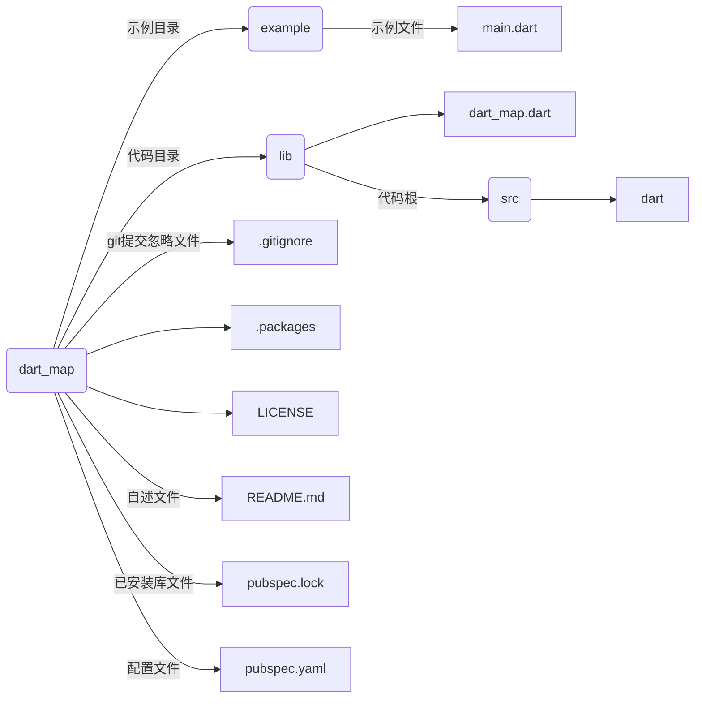

##### 通过library来声明库

每个Dart文件默认都是一个库 只是没有使用Library来显示声明

建议写成小写字母+下划线的形式

```dart
library main;//默认隐藏了一个main的Library的声明
main(){
print('Hello World');
}
```

##### import来引入库

```dart
//自定义库
import 'lib/main.dart';

```

##### 系统库

alt+鼠标库 可以查看源码

核心库默认会引入

```dart
import 'dart:math';
```

##### 引入部分库

包含引入show

```dart
import 'lib/common.dart' show f1,f3;
```

排除引入hide

```dart
import 'lib/common.dart' hide f1,f3;
```

##### 冲突库

```dart
import 'lib/f1.dart' as fun1;
//void func(){
//    print('the is f1 func');
//}

import 'lib/f1.dart' as fun2;
//void func(){
//    print('the is f1 func');
//}

//main.dart
void main(){
	fun1.func();
	fun2.func();
}
```

##### 延迟加载库

```dart
import 'lib/f1.dart' deferred as func;
void main(){
    func.hello();
    print('1');
    greet();
    print('2');
    print('3');
}
Future greet() async {
   await func.loadLibrary();
    func.func();
}
```

输出

1
2
3
Hello World

##### part 与 part of组装库

```dart
//home.dart
import 'util.dart';
void main(){
    //来自sub1.dart
    foo();
    //来自sub2.dart
    bar();
    //来自util.dart
    hello();
}
//util.dart
library util
part 'sub1.dart';
part 'sub2.dart';
String hello(){...}
//sub1.dart
part of util;
int foo(){}
//sub2.dart
part of util;
int bar(){}
```

##### 第三方库

来源

[pub](https://pub.dev)

[flutter](https://pub.flutter-io.co/packages)

[dartlang](https://pub.dartlang.org/flutter)

项目结构

第三方库，必须包含一个[pubspec.yaml](https://dart.cn/tools/pub/pubspec)

```yaml
#项目名
name: dart
#项目描述
description: 描述
#当前包版本号
version: 1.0.0+1
#包发布位置
publish_to: 'none'
#dart版本环境
environment:
  sdk: ">=2.7.0 <3.0.0"
#第三方库
dependencies:
  http: ^0.12.2
```





