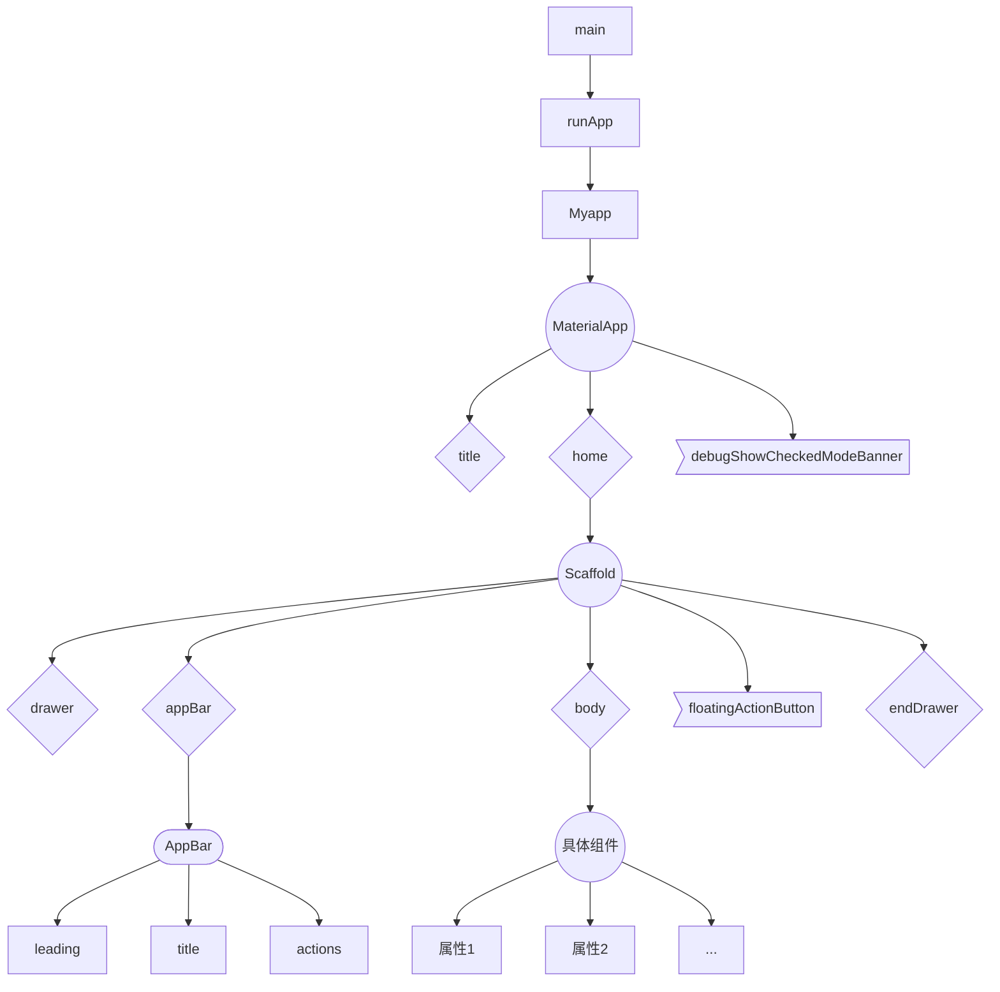
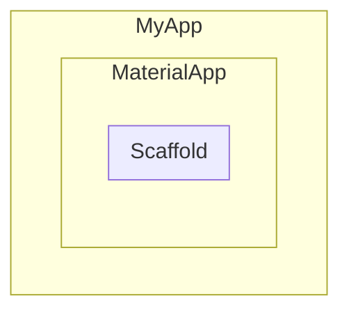
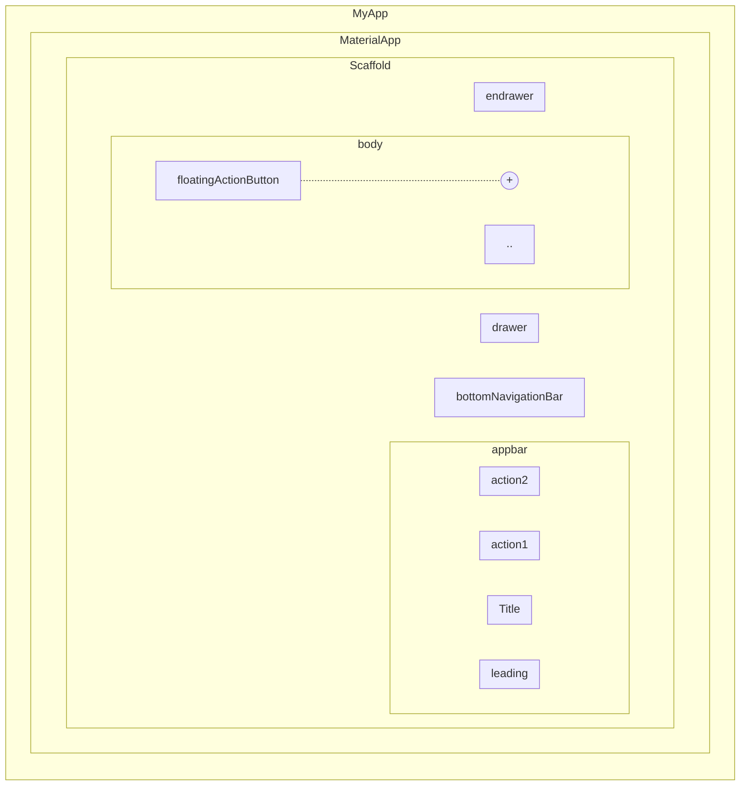

#### MaterialApp

title(任务管理器中的标题)

home（主内容）

debugShowCheckedModeBanner(是否形式右上角调试标记)

#### Scaffold

appBar(应用头部)

body(应用主体)

floatingActionButton(浮动按钮)

drawer(左侧抽屉菜单)

endDrawer(右侧抽屉菜单)



初始化项目App结构





```dart
import 'package:flutter/material.dart';

void main() {
     //下一个组件
  runApp(MyApp());
}
//MaterialApp
class MyApp extends StatelessWidget {
  @override
  Widget build(BuildContext context) {
    return MaterialApp(
      title: "Flutter",
         //下一个组件
      home: Home(),
      debugShowCheckedModeBanner: false,
    );
  }
}

//Scaffold
class Home extends StatelessWidget{
  @override
  Widget build(BuildContext context){
    return Scaffold(
      appBar:AppBar(
        title: Text("首页"),
        leading: Icon(Icons.menu),
        actions: [
          Icon(Icons.settings)
        ],
        elevation: 0.0,
        centerTitle: true,
      ),
        //下一个组件
      body: HelloFlutter(),
    );
  }
}

//Container
class HelloFlutter extends StatelessWidget {
  @override
  Widget build(BuildContext context) {
    return Container(
        child: Center(
          child: Text(
              "Hello Flutter",
              textDirection: TextDirection.ltr
          ),
        )
    );
  }
}
```
