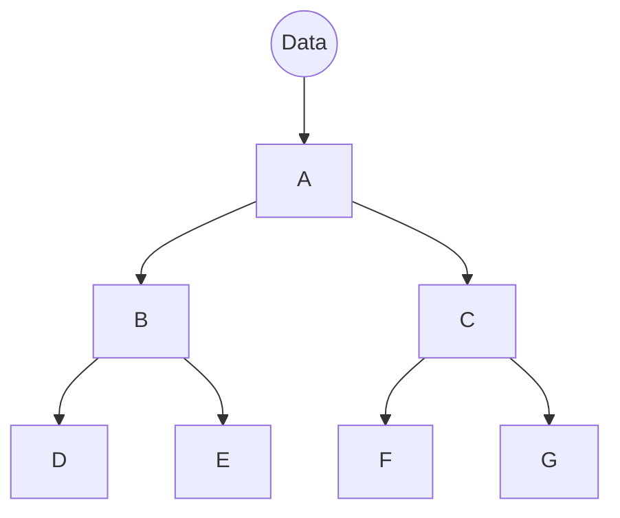
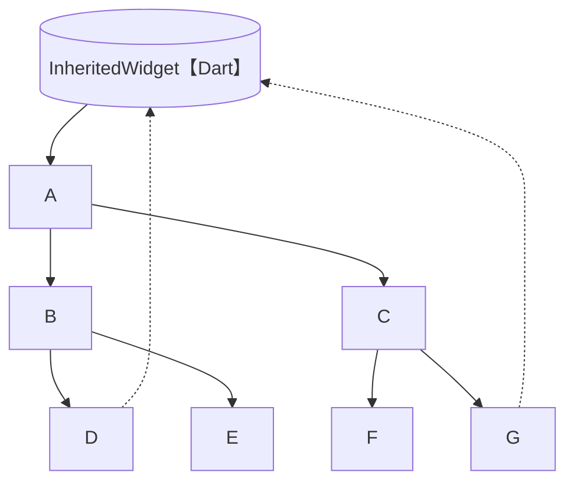

- what :提供了沿树向下，共享数据的功能
  - 即子组件可以获取父组件(InheritedWidget的子类)的数据
- Why:
  - 依赖构造函数传递数据的凡是不能满足业务要求
  - 所以，需要一个新的，更好的跨足件数据传输方案





- How:
  - buildContext.dependOnInheritedWidgetOfExactType<MyinheritedWidget>

```dart
import 'package:flutter/material.dart';

void main() {
  //下一个组件
  runApp(MyApp());
}

//MaterialApp
class MyApp extends StatelessWidget {
  @override
  Widget build(BuildContext context) {
    return MaterialApp(
      title: "Flutter",
      //下一个组件
      home: Home(),
      debugShowCheckedModeBanner: false,
    );
  }
}

//Scaffold
class Home extends StatelessWidget {
  @override
  Widget build(BuildContext context) {
    return Scaffold(
      appBar: AppBar(
        title: Text("StatefulWidget"),
        leading: Icon(Icons.menu),
        actions: [Icon(Icons.settings)],
        elevation: 0.0,
        centerTitle: true,
      ),
      //下一个组件
      body: MyState(),
    );
  }
}

class MyState extends StatefulWidget {
  @override
  _MyStateState createState() => _MyStateState();
}

class _MyStateState extends State<MyState> {
  int _num = 0;
  //跨组件共享数据

  void _increment() {
    setState(() {
      _num++;
    });
  }

  void _decrement() {
    setState(() {
      _num--;
    });
  }

  @override
  Widget build(BuildContext context) {
    return ShareDataWidget(
        Center(child: Column(
        children: [
          ElevatedButton(
              onPressed: _decrement, //
              child: Text('-')),
          Padding(
            padding: EdgeInsets.all(20),
            // child: Text('$_num'),
//            跨组件访问数据
            child: MyCounter(),
          ),
          ElevatedButton(onPressed: _increment, child: Icon(Icons.add)),
        ],
      ),
    ), num: _num);
  }
}

//数据共享组件
class ShareDataWidget extends InheritedWidget {
  final int num;
  final Widget child;
  ShareDataWidget(this.child,{key,@required this.num}) : super(key: key);

  static ShareDataWidget of(BuildContext context) {
    return context.dependOnInheritedWidgetOfExactType<ShareDataWidget>();
  }
  @override
  bool updateShouldNotify(ShareDataWidget old) {
    return true;
  }
}

class MyCounter extends StatefulWidget {
  const MyCounter({key}) : super(key: key);

  @override
  _MyCounterState createState() => _MyCounterState();
}

class _MyCounterState extends State<MyCounter> {
  @override
  Widget build(BuildContext context) {
    //使用inheritedWidget中共享数据
    return Text(ShareDataWidget.of(context).num.toString());
  }
}
```

