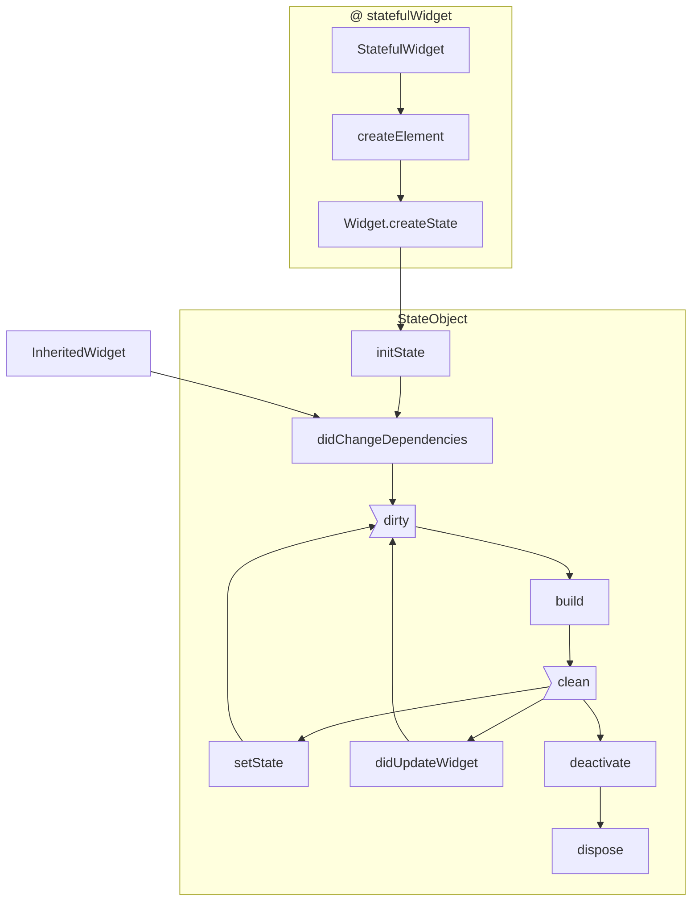

- initState() 组件对象插入到元素树中时
- didChangeDependencies()当前状态对象的依赖改变时
- build()组件渲染时
- setState()组件对象的内部组件变更时
- didUpdateWidget() 组件配置更新时
- deactive()组件对象在元素树中暂时移除时
- dispose() 组件对象在元素树中永远移除时



```dart
import 'package:flutter/cupertino.dart';
import 'package:flutter/material.dart';

void main() {
  //下一个组件
  runApp(MyApp());
}
//MaterialApp
class MyApp extends StatelessWidget {
  @override
  Widget build(BuildContext context) {
    return MaterialApp(
      title: "Flutter",
      //下一个组件
      home: Home(),
      debugShowCheckedModeBanner: false,
    );
  }
}

//Scaffold
class Home extends StatelessWidget{
  @override
  Widget build(BuildContext context){
    return Scaffold(
      appBar:AppBar(
        title: Text("StatefulWidget"),
        leading: Icon(Icons.menu),
        actions: [
          Icon(Icons.settings)
        ],
        elevation: 0.0,
        centerTitle: true,
      ),
      //下一个组件
      body: MyState(),
    );
  }
}


class MyState extends StatefulWidget {
  @override
  _MyStateState createState() => _MyStateState();
}

class _MyStateState extends State<MyState> {
  int _num;

  @override
  void initState() {
    // TODO: implement initState
    super.initState();
    print('init state');
    _num=1;
  }
  @override
  void didChangeDependencies() {
    // TODO: implement didChangeDependencies
    super.didChangeDependencies();
    print('didChangeDependencies');}
  @override
  void didUpdateWidget(covariant MyState oldWidget) {
    // TODO: implement didUpdateWidget
    super.didUpdateWidget(oldWidget);
    print('didUpdateWidget');
  }
  @override
  void deactivate() {
    // TODO: implement deactivate
    super.deactivate();
    print('deactivate');
  }
  @override
  void dispose() {
    // TODO: implement dispose
    super.dispose();
    print('dispose');
  }

  void _increment(){
    setState(
            (){
              print("setState");
          _num++;
        });
  }
  void _decrement(){
    setState((){
      print("setState");
          _num--;
        });
  }
  @override
  Widget build(BuildContext context) {
    print("build State");
    return Center(
      child: Column(
        children: [
          ElevatedButton(onPressed:_decrement, child: Text('-')),
          Padding(
           padding: EdgeInsets.all(20),
           child: Text('$_num'),
          ),
          ElevatedButton(onPressed:_increment, child: Icon(Icons.add)),
        ],
      ),
    );
  }
}
```
