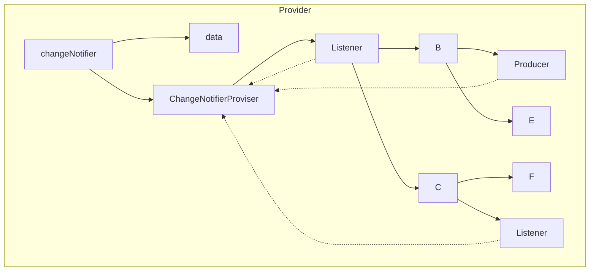
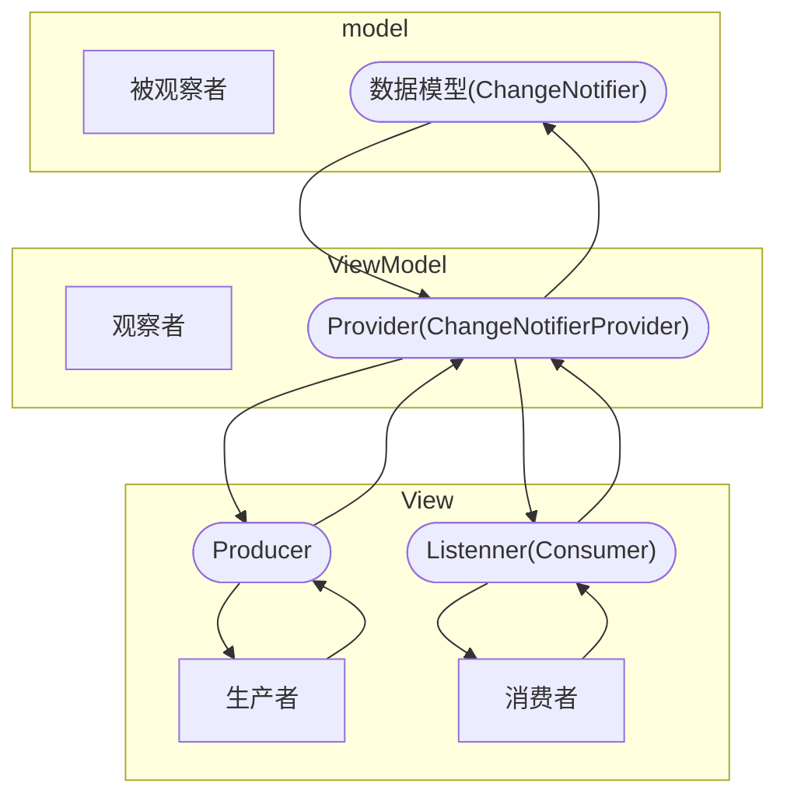
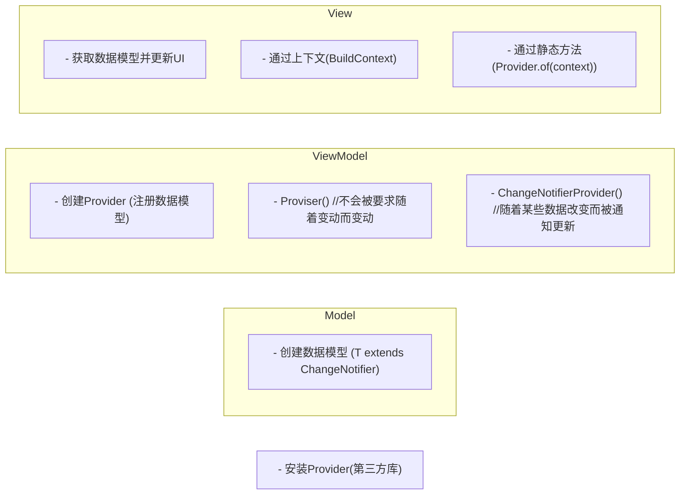

- Provider 是对InheritedWidget的封装
  - https://pub.dev/packages/provider
- 优点：
  - 简化资源的分配与处置
  - 懒加载
- Provider







```dart
import 'package:flutter/material.dart';
import 'package:provider/provider.dart';

void main() {
  //下一个组件
  runApp(MyApp());
}

//MaterialApp
class MyApp extends StatelessWidget {
  @override
  Widget build(BuildContext context) {
    return MaterialApp(
      title: "Flutter",
      //下一个组件
      home: Home(),
      debugShowCheckedModeBanner: false,
    );
  }
}

//Scaffold
class Home extends StatelessWidget {
  @override
  Widget build(BuildContext context) {
    // 创建Provider
    return ChangeNotifierProvider(
      create:(BuildContext context)=>new LikesModel(),
      child: Scaffold(
        appBar: AppBar(
          title: Text("LikesModel"),
          leading: Icon(Icons.menu),
          actions: [Icon(Icons.settings)],
          elevation: 0.0,
          centerTitle: true,
        ),
        //下一个组件
        body: MyHomePage(),
      ),

    );
  }
}

class LikesModel extends ChangeNotifier {
  int _counter = 0;

  int get counter => _counter;

  incrementCounter() {
    //累加
    _counter++;
    //通过 UI 更新
    notifyListeners();
  }
}

class MyHomePage extends StatelessWidget {
  const MyHomePage({Key key}) : super(key: key);
  @override
  Widget build(BuildContext context) {
    return Container(
      child: Column(
        children: [
          Text(
            //在子组件中使用数据类型
            "${ context.watch<LikesModel>().counter }",
          ),
          TextButton(
            onPressed:Provider.of<LikesModel>(context).incrementCounter,
            child: Icon(Icons.thumb_up),
          ),
        ],
      ),
    );
  }
}
```
