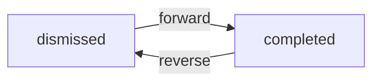

- why
  - UI界面设计合理的动画，可以让用户觉得更加流畅，直观，可以极大提高和改善用户体验
  - what(实现原理)
    - 动画就是动起来的画面
    - 视觉暂时留：画面经视神经传入大脑后，不hi立即消失（会存留一段时间）
    - 帧（Frame）:单个的画面，在学术上叫帧
    - 每秒中展示的帧数简称fps(Frame per Second)
  - 补间（Tween）d动画
    - 在补间动画中我们定义开始点和结束点，时间线以及定义转换时间和速度线。然后由系统计算，从开始到结束点。从而实现动画效果
    - 例如：透明度从0到1，颜色从0到255
  - 拟物动画
    - 拟物动画是对真实世界的行为进行建模。使动画效果类似现实中的物理效果
    - 例如：弹簧，阻尼，重力。抛物线


- Animation 是Flutter 动画库中的核心类。它包含动画的值和状态两个属性，定义了动画的一系列监听函数
  - 监听值
    - addListener
    - removeListener
  - 监听状态
    - addStatusListener
    - removeStatusListener


- AnimationStatus.dismissed
  - 动画初始状态
- AnimationStats.completed
  - 动画结束状态
- AnimationStatus.forward
  - 动画处在开始到结束的运行状态
- AnimationStatus.reverse
  - 动画处在结束到开始的运行状态



- AnimationController(动画控制器)
  - 在指定时间内，将组将属性值由初始值演变到终止值。从而形成动画效果。
- AnimationController参数
  - duration(动画的执行时间)
  - reverseDuration（动画方向执行时间）
  - lowerBound=0.0动画最小值
  - upperBound=1.0动画最大值
  - value(动画初始化，默认是lowerBound)
  - vsyn(TickerProvider类型的对象，用来创建Ticker对象)

- 当创建一个AnimationController时，需要拆改年底一个vsync参数
  - vsync的作用是:防止屏幕外动画（动画页面切换到后台时）消耗不必要的资源
  - 通过将SingkeTickerProviderStateMixin添加到类定义中，可以将stateful对象作为vsync的值
- AnimationController具有控制动画的方法:
  - .forward()可以正向执行动画
  - .reverse()可以反向执行动画
  - .dispose()用来释放动画资源(在不使用时需要调用该方法，否则会造成资源泄露)
  - .stop()用来停止动画运行


- Tween简介
  - AnimationController 动画生成值的默认区间是，0.0到1.0,如果希望使用不同的区间,或不同的数据类型,需要Tween(补间动画)
  - Tween的唯一职责就是定义从输入范围到输出范围的映射。
  - 例如颜色区间0到255
- Tween
  - Tween<double>(begin:初始值，end:终止值)
  - ColorTween(begin:Colors.withe,end:Colors.black);


- CurveAnimation简介
  - 动画执行的速度有多种(匀速，先快后慢或先慢后快)这里的熟读称为动画曲线
  - CurvedAnimation的目的是为了AnimationController添加动画曲线

- 组件
  - CurvedAnimation(parent:contrller,curve:Curves.easeln)
    - parent(动画控制器对象)
    - curve(正向执行的动画曲线)
    - reverseCurve
  - Curves
    - 动画曲线:https：//api.flutter.dev/dlutter/animation/Curves-class.html


- 创建动画控制器
  - controller=AnimationController(duration,vsync)
- 创建动画
  - 动画曲线(CurvedAnimation)
  - 补间动画（Tween）
- 监听动画
  - addListener()//监听动画生成值
  - addStatusListener()//监听动画状态
- 执行动画
  - controller.forward()//正向执行
  - controller.reverse()//反向执行

```dart
import 'package:flutter/cupertino.dart';
import 'package:flutter/material.dart';

void main() {
  //下一个组件
  runApp(MyApp());
}

//MaterialApp
class MyApp extends StatelessWidget {
  @override
  Widget build(BuildContext context) {
    return MaterialApp(
      title: "Flutter",
      //下一个组件
      home: Home(),
      debugShowCheckedModeBanner: false,
    );
  }
}

//Scaffold
class Home extends StatelessWidget {
  @override
  Widget build(BuildContext context) {
    return Scaffold(
      appBar: AppBar(
        title: Text("Animation"),
        leading: Icon(Icons.menu),
        actions: [Icon(Icons.settings)],
        elevation: 0.0,
        centerTitle: true,
      ),
      //下一个组件
      body: AnimationDemo(),
    );
  }
}

class AnimationDemo extends StatefulWidget {
  const AnimationDemo({Key key}) : super(key: key);

  @override
  _AnimationDemoState createState() => _AnimationDemoState();
}

class _AnimationDemoState extends State<AnimationDemo>
    with SingleTickerProviderStateMixin {
  AnimationController controller;
  Animation animation;

  @override
  void initState() {
    // TODO: implement initState
    super.initState();
    //  创建AnimationController
    controller = AnimationController(
        duration: Duration(milliseconds: 1000), vsync: this);
    //  2.1声明动画曲线
    animation = CurvedAnimation(parent: controller, curve: Curves.bounceIn);

    //  2.2设置动画值的范围
    animation = Tween(begin: 50.0, end: 400.0).animate(controller);
    //监听动画
    animation.addListener(() {
      print(animation.value);
      setState(() {});
    });
    //  执行动画
  }

  @override
  Widget build(BuildContext context) {
    return Center(
      child: Column(
        children: [
          ElevatedButton(
              onPressed: () {
                controller.forward();
              },
              child: Text("放大")),
          ElevatedButton(
              onPressed: () {
                controller.reverse();
              },
              child: Text("缩小")),
          ElevatedButton(
              onPressed: () {
                animation.addStatusListener((status) {
                  if (status == AnimationStatus.completed) {
                    controller.reverse();
                  } else if (status == AnimationStatus.dismissed) {
                    controller.forward();
                  }
                });
              },
              child: Text("重复")),
          ElevatedButton(
              onPressed: () {
                controller.stop();
              },
              child: Text("停止")),
          Icon(
            Icons.favorite,
            color: Colors.red,
            size: animation.value,
          ),
          Opacity(opacity: controller.value,
          child: Text("Hello World"),),
        ],
      ),
    );
  }
  @override
  void dispose() {
    // TODO: implement dispose
    super.dispose();
    controller.dispose();
  }
}
```

