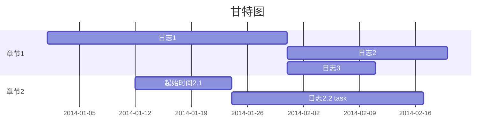
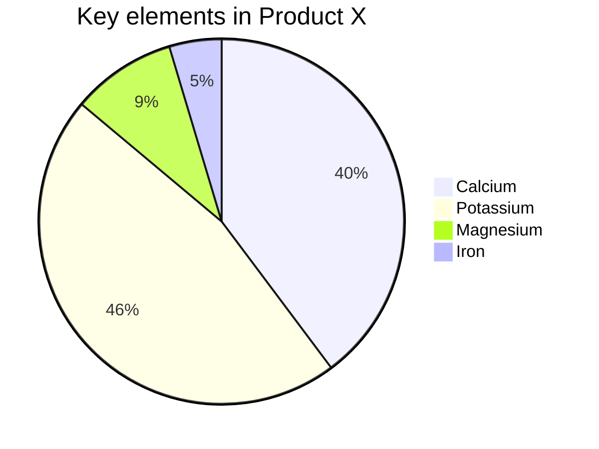
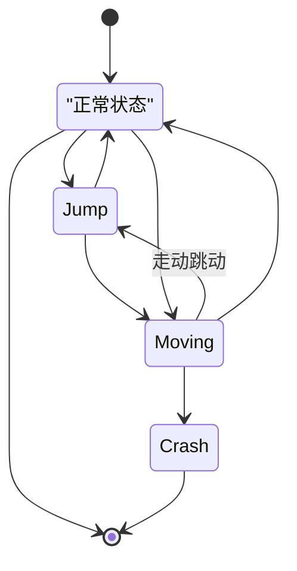

## mermaid

## 流程图

#### 图标

| graph | 格式       |
| ----- | ---------- |
| TB    | 上下(默认) |
| TD    | 上下       |
| BT    | 下上       |
| RL    | 右左       |
| LR    | 左右       |

#### 形状

| 格式   | 说明         |
| ------ | ------------ |
| \[ \]  | 方形(默认)   |
| \( \)  | 圆角         |
| [( )]  | 圆柱         |
| ([ ])  | 大圆角       |
| (( ))  | 圆形         |
| > ]    | 旗标         |
| \{ \}  | 菱形         |
| {{ }}  | 六角形       |
| [/ /]  | 平行四边形   |
| [\ \\] | 反平行四边形 |
| [/ \\] | 梯形         |
| [\\ /] | 反梯形       |

#### 连接
| 符号 | 线条 |
| ---- | ---- |
| `-->` | 箭头实线连接 |
| `---` | 单线实线连接 |
| `-- text ---` | 单线注释连接1 |
| `---| text |`| 单线注释连接2 |
| `--text-->` | 箭头注释连接3 |
| `--->|text|` | 箭头注释连接4 |
| `-.->` | 箭头虚线连接 |
| `-. text .->` | 箭头虚线注释连接 |
| `==>` | 大箭头连接 |
| === | 粗线连接 |

> 可以***&***符号连接多个节点，也可以多个节点连接一个节点。
>
> 使用***“”***来转义

#### 子圈

`subgraph title
    graph definition
end`

#### 事件绑定

`click node callback`

`click nodeId call callback()`

#### 注释

注释 ***%%*** 开始忽略任何语法

#### 样式

- `style node style` 节点样式

- `classDef className style`声明类
  - `class node1,node2 className;` 样式附加方式1
  - `node:::className` 直接在流程中附加样式

style 描述svg 样式 `,` 来分割; fill 填充色， stroke 线条 stroke-width 线条宽度 color 前置色。
具体参照 [svg stroke 属性](http://home.ustc.edu.cn/~xie1993/svg/svg-stroke.html)


## 序列图

| 参数                   | 说明                |
| ---------------------- | ------------------- |
| sequenceDiagram        | 声明序列图          |
| participant            | 参与者              |
| participant J as John  | J作为John的别名     |
| ->>                    | 实线箭头            |
| -->>                   | 虚线箭头            |
| -x                     | 十字架的实线箭头    |
| --x                    | 十字架的虚线箭头    |
| activate/+             | 激活某人            |
| deactivate/-           | 使某人失效          |
| Note right of John:xxx | 在xxx的右边添加注释 |
| loop xxx               | 为某个范围添加标题  |
| end                    | 结束                |

## 甘特图

```mathematica
%%声明类型
gantt
	%%标题
    title 甘特图
    %% 声明格式：日期格式
    dateFormat  YYYY-MM-DD 
    %%部分名称
    section 章节1
    %%部分内容 日期格式 
    日志1             :a1, 2014-01-01, 30d
    日志2             :after a1  , 20d
    日志3             :after a1 , 11d
    section 章节2
    起始时间2.1       :2014-01-12  , 12d 
    日志2.2 task      : 24d 
```




## 饼状图

```mathematica
%%声明类型
pie
	%%饼图标题
    title Key elements in Product X
    %%标题 及其 占比
    "Calcium" : 42.96
    "Potassium" : 50.05
    "Magnesium" : 10.01
    "Iron" :  5
```




## 状态图

```mathematica
%%声明类型
stateDiagram
	%%把值赋给IDLE  以便使用
    IDLE: "正常状态"
    %% [*] 特殊
    [*] --> IDLE
    IDLE --> [*]

    IDLE --> Jump 
    Jump --> IDLE
    %% 相当于Graph的 Moving --> |走动跳动| Jump
    Moving --> Jump : 走动跳动
    Jump --> Moving

    IDLE --> Moving
    Moving --> IDLE
    Moving --> Crash
    Crash --> [*]
```



